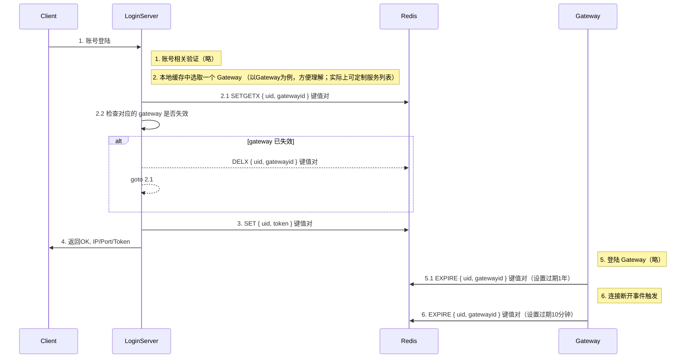

```mermaid
sequenceDiagram
participant Client
participant LoginServer
participant Redis
participant Gateway
Client->>LoginServer: 1. 账号登陆
Note right of LoginServer: 1. 账号相关验证（略）
Note right of LoginServer: 2. 本地缓存中选取一个 Gateway （以Gateway为例，方便理解；实际上可定制服务列表）
LoginServer->>Redis: 2.1 SETGETX { uid, gatewayid } 键值对
LoginServer->>LoginServer: 2.2 检查对应的 gateway 是否失效
alt gateway 已失效
  LoginServer-->>Redis: DELX { uid, gatewayid } 键值对
  LoginServer-->>LoginServer: goto 2.1
end
LoginServer->>Redis: 3. SET { uid, token } 键值对
LoginServer->>Client: 4. 返回OK, IP/Port/Token
Note right of Gateway: 5. 登陆 Gateway（略）
Gateway->>Redis: 5.1 EXPIRE { uid, gatewayid } 键值对（设置过期1年）
Note right of Gateway: 6. 连接断开事件触发
Gateway->>Redis: 6. EXPIRE { uid, gatewayid } 键值对（设置过期10分钟）
```
