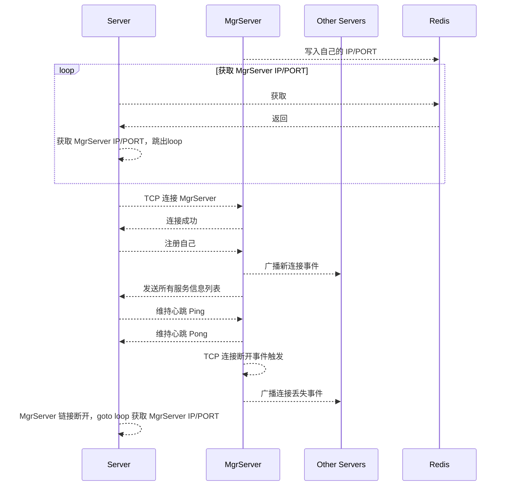

```mermaid
sequenceDiagram
participant Server
participant MgrServer
participant Other Servers
participant Redis
MgrServer-->>Redis: 写入自己的 IP/PORT
loop 获取 MgrServer IP/PORT
Server-->>Redis: 获取
Redis-->>Server: 返回
Server-->>Server: 获取 MgrServer IP/PORT，跳出loop
end
Server-->>MgrServer: TCP 连接 MgrServer
MgrServer-->>Server: 连接成功
Server-->>MgrServer: 注册自己
MgrServer-->>Other Servers: 广播新连接事件
MgrServer-->>Server: 发送所有服务信息列表     
Server-->>MgrServer: 维持心跳 Ping
MgrServer-->>Server: 维持心跳 Pong
MgrServer-->>MgrServer: TCP 连接断开事件触发
MgrServer-->>Other Servers: 广播连接丢失事件
Server-->>Server: MgrServer 链接断开，goto loop 获取 MgrServer IP/PORT
```
