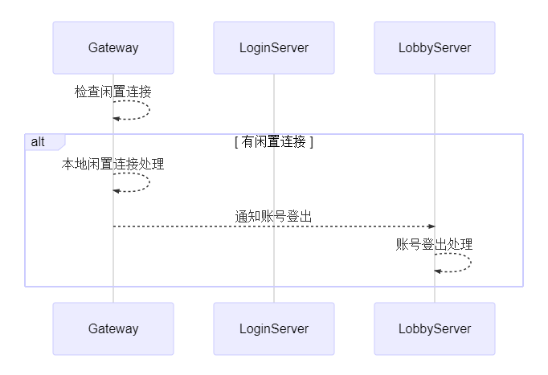

## 登出模块

账号登出游戏，涉及到资源释放、游戏存档等问题

且每个服务器都可能有特殊的登出机制

这里详细罗列下：
- 框架层对每个服务的登出处理
- servers 例子服务实现中的登出处理

## Login 服务

- 框架层
  - 无账号相关内容

- servers
  - [user.go](../services/login/user.go) ，TCP 客户端会话类，在连接断开时会触发关闭，并销毁

## Gateway 服务

- 框架层
  - [user_mgr.go](../internal/components/node/gateway/user_mgr.go) ，[闲置连接处理](框架层功能-闲置连接处理.md)
    - 默认连接 5 分钟不活跃，则判断为闲置连接。触发关闭连接、删除等操作
    - 账号被判断为闲置连接的处理中，会发送`丢失账号`消息通知账号相关联的服务
    - Gateway `登录亲和性`，默认闲置删除后 5 分钟内还存在。即 5 + 5 ， 10 分钟内账号对 Gateway 有`登录亲和性`
- servers
  - [user.go](../services/gateway/user.go) ，TCP 客户端会话类，在连接断开时会触发关闭，并销毁
  - [user_mgr.go](../services/gateway/user_mgr.go) ，TCP 客户端会话管理类，在连接断开时会触发删除操作

## Lobby 服务

- 框架层

  

- servers
  - [account_mgr.go](../services/lobby/account_mgr.go) ，框架层触发账号登出时，触发该函数账号登出处理
