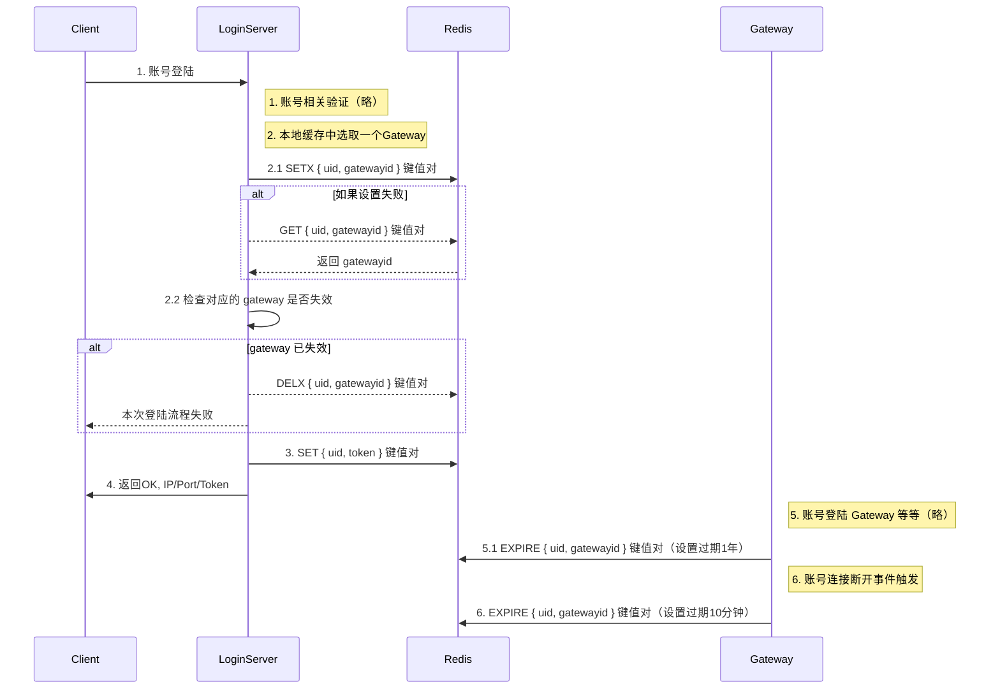

## 框架层负责的工作

- 提供缺省账号验证
- 提供账号正常登陆
  - 提供账号正常上下线，不会回档等错误
  - 提供同账号多端同时登陆，不会异常
  - 提供账号服务器资源分配、比如分配 Gateway 资源
  - 提供自定义验证接口，方便定制化`账号验证`逻辑

## 时序图

补充说明：
  - `SETX` ：不管 SET NX 有没有设置成功，都重置过期时间为 1 年
  - `DELX` ：条件删除， if value = "xxx" then del key
  - 1 、 4 逻辑层自定义处理
  - 2 、 3 框架层处理
  - 5 、 6 内容 Gateway 相关，其他文档详细说明
