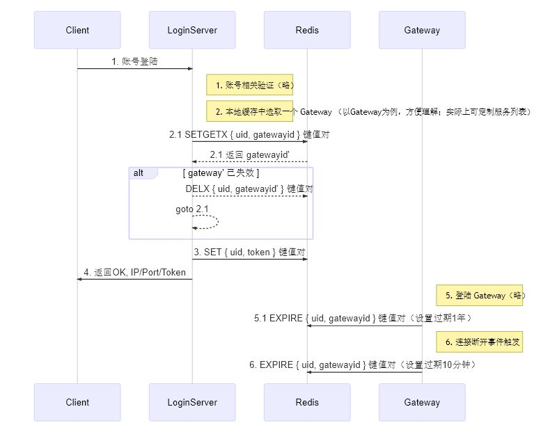

## 框架层负责的工作

- 提供缺省账号验证
- 提供账号正常登陆
  - 提供账号正常上下线，不会回档等错误
  - 提供同账号多端同时登陆，不会异常
  - 提供账号服务器资源分配（可自定义分配哪些资源）
  - 提供自定义验证接口，方便定制化`账号验证`逻辑

## 逻辑层负责的工作

- 自定义登陆协议（如使用 TCP 、 HTTP ； 如使用 proto 消息、 struct 消息 等等）
- 自定义客户端交互流程
- 自定义账号验证过程
- 自定义分配哪些服务器资源给账号

## 时序图

补充说明：
- `SETGETX`
  - 原子操作，封装`不管 SETGETX 有没有设置成功，都重置过期时间为 n`
  - 返回值，`空`表示设置成功；`非空`表示设置失败，并返回原先已设置的值
- `DELX`
  - 原子操作，封装`条件删除， if value = "xxx" then del key`
  - 返回值， 1 有删除操作； 0 不需要删除
- 1 、 4 逻辑层自定义处理
- 2 、 3 框架层处理
- 5 、 6 防止`同 1 账号开服期间只登陆同一个 Gateway`
