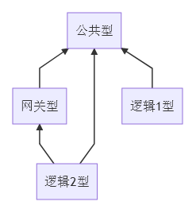

## 服务器类型

功能上分，三类服务器：

- 公共型
  - 其他服务器都会连接公共型
  - 目前有：
    - 管理服务器
    - 数据库服务器（ Redis ）

- 网关型
  - 需要消息中继的，会连接网关
  - 通过网关实现以下消息传递：
    - Client(s) <-> Gateway <-> Node
    - Node <-> Gateway <-> Other Node(s)

- 逻辑型
  - 提供某种功能的逻辑服务器
  - 需要消息中继，则会连接网关

## 拓扑图

三层结构，横向扩展：

有以下特点：

- 横向扩展
- 简单连接
  - 单向，非网状
  - 网关起桥梁作用，中继消息
