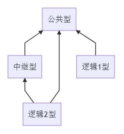

## 服务器类型

从`连接关系`上分，有三类服务器：

- 公共型
  - 其他服务器都会连接公共型
  - 目前有：
    - 管理服务器
    - 数据库服务器（ Redis ）

- 中继型
  - 中继消息的服务器
  - 目前有：
    - 网关， Client(s) <-> 中继型 <-> Node
    - 中继服务器， Node <-> 中继型 <-> Other Node(s)
  - 网关、中继服务器可以简化合进一个进程，亦可拆分
  - 本实作将网关、中继服务器合为 1 个进程，并称为 Gateway

- 逻辑型
  - 提供某种功能的逻辑服务器
  - 需要消息中继，则会连接中继型服务器

## 拓扑图

三层结构，横向扩展：

有以下特点：

- 横向扩展
- 简单连接
  - 单向，非网状
  - 中继型起桥梁作用
- 逻辑型接入简单
